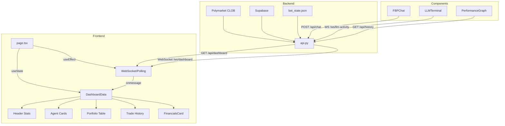

# PolyAgent Dashboard - Complete Architecture Documentation

> **Comprehensive guide to the dashboard frontend components, hooks, API endpoints, design system, and data flow.**

---

## Table of Contents

1. [Technology Stack](#technology-stack)
2. [Project Structure](#project-structure)
3. [Core Components](#core-components)
4. [UI Component Library](#ui-component-library)
5. [Hooks](#hooks)
6. [API Endpoints](#api-endpoints)
7. [WebSocket Connections](#websocket-connections)
8. [Data Flow & State Management](#data-flow--state-management)
9. [Design System & Styling](#design-system--styling)

---

## Technology Stack

| Category | Technology | Version |
|----------|-----------|---------|
| Framework | Next.js | 16.0.10 |
| UI Library | React | 19.2.0 |
| Styling | TailwindCSS | 4.1.9 |
| Component Primitives | Radix UI | Various |
| Charts | Recharts | 2.15.4 |
| Markdown | react-markdown | 10.1.0 |
| Theming | next-themes | 0.4.6 |
| Animations | tw-animate-css | 1.3.3 |
| Analytics | @vercel/analytics | 1.3.1 |
| Forms | react-hook-form | 7.60.0 |

---

## Project Structure

```
dashboard-frontend/
├── app/
│   ├── globals.css          # Design system & CSS variables
│   ├── layout.tsx           # Root layout with theme provider
│   └── page.tsx             # Main dashboard page (673 lines)
├── components/
│   ├── fbp-chat.tsx         # AI chat interface
│   ├── llm-terminal.tsx     # LLM activity terminal
│   ├── financials-card.tsx  # Cost breakdown display
│   ├── performance-graph.tsx# Portfolio chart
│   ├── theme-toggle.tsx     # Dark/light mode switch
│   ├── theme-provider.tsx   # Theme context wrapper
│   └── ui/                  # 57 shadcn/ui primitives
├── hooks/
│   ├── use-toast.ts         # Toast notification system
│   └── use-mobile.ts        # Mobile breakpoint detection
├── lib/
│   ├── api-url.ts           # API & WebSocket URL helpers
│   └── utils.ts             # Tailwind class merger utility
└── public/
    └── (icons and assets)
```

---

## Core Components

### 1. Main Dashboard Page - [page.tsx](file:///Users/farzad/polyagent/dashboard-frontend/app/page.tsx)

**Purpose:** The main dashboard interface that orchestrates all data fetching, state, and renders the complete UI.

**Key Interfaces:**

```typescript
interface DashboardData {
  balance: number           // USDC balance
  equity: number            // Total equity (balance + positions)
  unrealizedPnl: number     // Unrealized profit/loss
  gasSpent: number          // Polygon gas costs
  total_redeemed: number    // Total redeemed from won positions
  costs: {
    openai: number          // OpenAI API costs
    perplexity: number      // Perplexity API costs
    gemini: number          // Gemini API costs
    fly: number             // Fly.io hosting costs
    neural_total: number    // Total neural costs
    infra_total: number     // Total infrastructure costs
  }
  riskStatus: { safe: boolean; message: string }
  agents: {
    safe: { running: boolean; activity: string; endpoint: string }
    scalper: { running: boolean; activity: string; endpoint: string }
    copyTrader: { running: boolean; lastSignal: string }
    smartTrader: { running: boolean; activity: string; positions: number; trades: number; mode: string; lastScan: string }
    esportsTrader: { running: boolean; activity: string; trades: number; mode: string; lastScan: string; pnl: number }
    sportsTrader: { running: boolean; activity: string; trades: number; mode: string; lastScan: string }
  }
  positions: Array<{ market: string; side: string; cost: number; value: number; pnl: number }>
  openOrders: Array<{ id: string; market: string; side: string; size: number; price: number; filled: number }>
  trades: Array<{ time: string; market: string; side: string; amount: number }>
  stats: { tradeCount: number; volume24h: number }
  dryRun: boolean           // Simulation mode flag
  lastUpdate: string
  walletAddress: string
  maxBetAmount?: number
}
```

**State Variables:**
| State | Type | Purpose |
|-------|------|---------|
| `data` | `DashboardData | null` | Main dashboard data |
| `maxBet` | `number` | Maximum bet amount config |
| `updatingConfig` | `boolean` | Config update loading state |
| `connectionError` | `string | null` | API connection error message |
| `notifications` | `Notification[]` | Live match alerts |
| `showNotifications` | `boolean` | Notification panel visibility |
| `mobilePanel` | `'chat' | 'terminal' | null` | Mobile panel state |
| `expandedAgent` | `string | null` | Expanded agent description |

**Key Functions:**

| Function | Purpose | API Endpoint |
|----------|---------|--------------|
| `fetchDashboardData()` | Fetch main dashboard data | `GET /api/dashboard` |
| `toggleAgent(agent)` | Enable/disable an agent | `POST /api/toggle-agent` |
| `toggleDryRun(current)` | Toggle simulation mode | `POST /api/update-config` |
| `emergencyStop()` | Stop all agents | `POST /api/emergency-stop` |
| `checkLiveMatches()` | Check for esports matches | `GET /api/live-matches` |

**Agent Color Themes:**
```typescript
const AGENT_THEMES = {
  safe:         { bg: "bg-emerald-500/10", text: "text-emerald-400", icon: Shield },
  scalper:      { bg: "bg-amber-500/10",   text: "text-amber-400",   icon: Zap },
  copyTrader:   { bg: "bg-violet-500/10",  text: "text-violet-400",  icon: Users },
  smartTrader:  { bg: "bg-blue-500/10",    text: "text-blue-400",    icon: Brain },
  esportsTrader:{ bg: "bg-pink-500/10",    text: "text-pink-400",    icon: Gamepad2 },
  sportsTrader: { bg: "bg-orange-500/10",  text: "text-orange-400",  icon: Trophy },
}
```

---

### 2. FBP Chat - [fbp-chat.tsx](file:///Users/farzad/polyagent/dashboard-frontend/components/fbp-chat.tsx)

**Purpose:** AI-powered chat interface with tool calling capabilities for trading operations.

**Key Interfaces:**

```typescript
interface Message {
  role: "user" | "assistant"
  content: string
  toolCalls?: ToolCall[]
  timestamp: Date
}

interface ToolCall {
  tool: string
  params: Record<string, unknown>
  result: Record<string, unknown> | string
}
```

**Available Tools (with icons):**
| Tool | Icon | Purpose |
|------|------|---------|
| `get_balance` | Wallet | Fetch USDC balance |
| `get_positions` | BarChart3 | Get open positions |
| `get_agents` | Activity | Get agent statuses |
| `search_markets` | Search | Search Polymarket markets |
| `get_market_details` | TrendingUp | Get market info |
| `research` | Brain | Research markets |
| `analyze_market` | Zap | Analyze trading opportunity |
| `open_trade` | TrendingUp | Execute a trade |
| `close_position` | TrendingDown | Close a position |
| `toggle_agent` | Power | Toggle agent on/off |
| `get_prices` | DollarSign | Get crypto prices |
| `get_llm_activity` | Activity | Get LLM logs |

**API Endpoints Used:**
- `POST /api/chat/{sessionId}` - Send chat message
- `DELETE /api/chat/{sessionId}` - Clear session

**Sub-Components:**
- `MessageBubble` - Renders individual messages with tool results
- `ToolResultCard` - Specialized cards for different tool response types

---

### 3. LLM Terminal - [llm-terminal.tsx](file:///Users/farzad/polyagent/dashboard-frontend/components/llm-terminal.tsx)

**Purpose:** Real-time display of LLM (AI model) activity from trading agents.

**Key Interfaces:**

```typescript
interface LLMActivity {
  id: string
  agent: string
  timestamp: string
  action_type: string
  market_question: string
  prompt_summary: string
  reasoning: string
  conclusion: string
  confidence: number
  data_sources: string[]
  duration_ms: number
  tokens_used: number
  cost_usd: number
}

interface LLMStats {
  total_calls: number
  total_tokens: number
  total_cost_usd: number
  avg_confidence: number
  by_agent: { [key: string]: { calls: number; avg_confidence: number; bet_rate: number } }
  decisions: { BET: number; PASS: number; ERROR: number }
}
```

**Connection Strategy:**
1. **Primary:** WebSocket at `wss://.../ws/llm-activity`
2. **Fallback:** REST polling at `GET /api/llm-activity?limit=50` every 5 seconds

**Visual Styling:**
| Agent | Color |
|-------|-------|
| safe | `text-emerald-400` |
| scalper | `text-amber-400` |
| copy | `text-violet-400` |

| Conclusion | Color |
|------------|-------|
| BET | `text-emerald-400` |
| PASS | `text-zinc-500` |
| ERROR | `text-red-400` |
| TIMEOUT | `text-orange-400` |

---

### 4. Financials Card - [financials-card.tsx](file:///Users/farzad/polyagent/dashboard-frontend/components/financials-card.tsx)

**Purpose:** Displays detailed cost breakdown and true net PnL calculation.

**True Net PnL Formula:**
```
TrueNetPnL = (UnrealizedPnL + TotalRedeemed) - GasSpent - NeuralCosts - InfraCosts
```

**Cost Breakdown Display:**
| Line Item | Color | Notes |
|-----------|-------|-------|
| Total Redeemed | `text-emerald-400` | Revenue |
| OpenAI (Auditor) | `text-red-400` | Billed |
| Perplexity (Research) | `text-blue-400` | Credit-based |
| Gemini (Fallback) | `text-emerald-500` | Free tier |
| Fly.io (8x Cluster) | `text-red-400` | Infrastructure |
| Polygon Gas (Est) | `text-red-400/80` | Blockchain fees |

---

### 5. Performance Graph - [performance-graph.tsx](file:///Users/farzad/polyagent/dashboard-frontend/components/performance-graph.tsx)

**Purpose:** 24-hour portfolio equity chart using Recharts.

**API Endpoint:** `GET /api/history?period=24h`

**Interface:**
```typescript
interface HistoryPoint {
  timestamp: string
  equity: number
  balance: number
  unrealized_pnl: number
}
```

**Features:**
- Auto-refreshes every 60 seconds
- Dynamic color based on performance (green/red)
- Gradient fill under curve
- Responsive container

---

### 6. Theme Toggle - [theme-toggle.tsx](file:///Users/farzad/polyagent/dashboard-frontend/components/theme-toggle.tsx)

**Purpose:** Switch between dark and light themes.

**Hook Used:** `useTheme()` from `next-themes`

**Icons:** Sun (light) / Moon (dark) with rotation animation

---

### 7. Theme Provider - [theme-provider.tsx](file:///Users/farzad/polyagent/dashboard-frontend/components/theme-provider.tsx)

**Purpose:** Wraps the app to provide theme context.

**Config:**
- `attribute="class"` - Uses CSS class for theming
- `defaultTheme="dark"` - Dark mode by default
- `enableSystem` - Respects system preference
- `disableTransitionOnChange` - No flash on theme change

---

## UI Component Library

57 shadcn/ui components in `/components/ui/`:

### Form & Input
- `button.tsx`, `button-group.tsx`
- `input.tsx`, `input-group.tsx`, `input-otp.tsx`
- `textarea.tsx`
- `checkbox.tsx`, `radio-group.tsx`
- `select.tsx`
- `switch.tsx`
- `slider.tsx`
- `form.tsx`, `field.tsx`
- `label.tsx`
- `calendar.tsx`

### Layout & Navigation
- `card.tsx`
- `table.tsx`
- `tabs.tsx`
- `accordion.tsx`
- `collapsible.tsx`
- `sidebar.tsx`
- `navigation-menu.tsx`
- `menubar.tsx`
- `breadcrumb.tsx`
- `pagination.tsx`
- `separator.tsx`
- `aspect-ratio.tsx`
- `resizable.tsx`
- `scroll-area.tsx`

### Overlay & Dialogs
- `dialog.tsx`
- `drawer.tsx`
- `sheet.tsx`
- `alert-dialog.tsx`
- `popover.tsx`
- `hover-card.tsx`
- `tooltip.tsx`
- `dropdown-menu.tsx`
- `context-menu.tsx`
- `command.tsx`

### Feedback
- `alert.tsx`
- `badge.tsx`
- `toast.tsx`, `toaster.tsx`
- `sonner.tsx`
- `progress.tsx`
- `skeleton.tsx`
- `spinner.tsx`
- `empty.tsx`

### Data Display
- `avatar.tsx`
- `carousel.tsx`
- `chart.tsx`
- `item.tsx`
- `kbd.tsx`

### Toggle
- `toggle.tsx`, `toggle-group.tsx`

---

## Hooks

### 1. useToast - [use-toast.ts](file:///Users/farzad/polyagent/dashboard-frontend/hooks/use-toast.ts)

**Purpose:** Global toast notification system (inspired by react-hot-toast).

**API:**
```typescript
const { toasts, toast, dismiss } = useToast()

toast({
  title: "Success",
  description: "Operation completed",
  variant: "default" | "destructive"
})

dismiss(toastId?)  // Dismiss specific or all toasts
```

**Config:**
- `TOAST_LIMIT = 1` - Max toasts shown
- `TOAST_REMOVE_DELAY = 1000000` - Auto-dismiss delay

---

### 2. useIsMobile - [use-mobile.ts](file:///Users/farzad/polyagent/dashboard-frontend/hooks/use-mobile.ts)

**Purpose:** Detects if viewport is mobile width.

**API:**
```typescript
const isMobile = useIsMobile()  // boolean
```

**Breakpoint:** `768px`

---

## API Endpoints

All endpoints are served from the backend at `https://polymarket-bots-farzad.fly.dev` (or via env vars).

### Dashboard & State

| Method | Endpoint | Description |
|--------|----------|-------------|
| `GET` | `/api/dashboard` | Main dashboard data |
| `POST` | `/api/toggle-agent` | Toggle agent on/off |
| `POST` | `/api/update-config` | Update config (dry_run, max_bet) |
| `POST` | `/api/toggle-dry-run` | Toggle simulation mode |
| `POST` | `/api/emergency-stop` | Stop all agents |
| `GET` | `/api/live-matches` | Get live esports matches |

### Positions & Orders

| Method | Endpoint | Description |
|--------|----------|-------------|
| `GET` | `/api/positions` | Get all open positions |
| `GET` | `/api/open-orders` | Get pending orders |
| `POST` | `/api/cancel-order` | Cancel specific order |
| `POST` | `/api/cancel-all-orders` | Cancel all orders |
| `POST` | `/api/close-position` | Sell shares in a position |
| `POST` | `/api/close-all-positions` | Close all positions |

### History & Ledger

| Method | Endpoint | Description |
|--------|----------|-------------|
| `GET` | `/api/history?period=24h` | Portfolio history |
| `GET` | `/api/trade-history?limit=50` | Trade history |
| `GET` | `/api/trade-ledger?limit=100` | Full trade ledger |
| `GET` | `/api/context-summary` | Shared context summary |

### LLM Activity

| Method | Endpoint | Description |
|--------|----------|-------------|
| `GET` | `/api/llm-activity?limit=50` | LLM activity logs |

### Chat (FBP Agent)

| Method | Endpoint | Description |
|--------|----------|-------------|
| `POST` | `/api/chat` | Send chat (no session) |
| `POST` | `/api/chat/{session_id}` | Send chat with session |
| `DELETE` | `/api/chat/{session_id}` | Clear session |
| `GET` | `/api/chat/sessions` | List all sessions |
| `GET` | `/api/chat/{session_id}/messages` | Get session messages |

### Redemption

| Method | Endpoint | Description |
|--------|----------|-------------|
| `POST` | `/api/redeem-positions` | Redeem winning positions |

### Health & Debug

| Method | Endpoint | Description |
|--------|----------|-------------|
| `GET` | `/health` | Health check |
| `GET` | `/test-env` | Environment debug |
| `GET` | `/` | Root (Vercel) |

---

## WebSocket Connections

### Dashboard WebSocket
- **URL:** `wss://polymarket-bots-farzad.fly.dev/ws/dashboard`
- **Payload:** `DashboardData` (same as REST endpoint)
- **Fallback:** REST polling every 3 seconds

### LLM Activity WebSocket
- **URL:** `wss://polymarket-bots-farzad.fly.dev/ws/llm-activity`
- **Payload:** `{ activities: LLMActivity[], stats: LLMStats }`
- **Fallback:** REST polling every 5 seconds

---

## Data Flow & State Management



---

## Design System & Styling

### CSS Variables - [globals.css](file:///Users/farzad/polyagent/dashboard-frontend/app/globals.css)

**Light Mode:**
```css
:root {
  --background: oklch(0.985 0 0);
  --foreground: oklch(0.1 0 0);
  --primary: oklch(0.45 0.15 145);    /* Green */
  --muted-foreground: oklch(0.45 0 0);
  --border: oklch(0.88 0 0);
}
```

**Dark Mode:**
```css
.dark {
  --background: oklch(0.06 0 0);      /* Deep black */
  --foreground: oklch(0.96 0 0);
  --primary: oklch(0.75 0.15 145);
  --muted-foreground: oklch(0.55 0 0);
  --border: oklch(0.2 0 0);
}
```

### Utility Classes

| Class | Purpose |
|-------|---------|
| `.glass` | Glassmorphism effect with blur |
| `.glass-strong` | Stronger blur version |
| `.dot-texture` | Subtle dot pattern overlay |
| `.matrix-grid` | Grid background pattern |
| `.shimmer` | Loading shimmer animation |
| `.terminal-scroll` | Custom scrollbar for terminal |
| `.chat-prose` | Markdown styling for chat |
| `.gradient-text` | Gradient text effect |
| `.glow-emerald/amber/violet/red` | Glow effects |

### Animations

| Animation | Effect |
|-----------|--------|
| `fade-in` | Fade in |
| `float-up` | Slide up + fade |
| `morph-in` | Scale + fade |
| `slide-in-right/left` | Horizontal slide |
| `scale-bounce` | Bounce scale |
| `glow-pulse` | Pulsing glow |
| `thinking-dots` | Chat typing indicator |
| `ripple` | Touch feedback |
| `shimmer` | Loading shimmer |

### Stagger Animation
```css
.stagger > *:nth-child(1) { animation-delay: 0ms; }
.stagger > *:nth-child(2) { animation-delay: 40ms; }
/* ... up to 6 children */
```

### Font Stack
- **Sans:** Inter (via next/font)
- **Mono:** JetBrains Mono (via next/font)

---

## Library Utilities

### api-url.ts

```typescript
getApiUrl()  // Returns API base URL (no trailing slash)
getWsUrl()   // Converts HTTP to WS protocol
```

**Environment Variables:**
- `NEXT_PUBLIC_API_URL`
- `NEXT_PUBLIC_FLY_API_URL`
- Default: `https://polymarket-bots-farzad.fly.dev`

### utils.ts

```typescript
cn(...inputs: ClassValue[])  // Tailwind class merger
```

---

## Summary

The PolyAgent Dashboard is a sophisticated real-time trading interface built with:

- **7 core components** handling specific UI domains
- **57 UI primitives** from shadcn/ui for consistent design
- **2 custom hooks** for toasts and mobile detection
- **2 utility libraries** for API URLs and class merging
- **20+ REST endpoints** for trading operations
- **2 WebSocket streams** for real-time updates
- **Comprehensive design system** with light/dark themes, animations, and glassmorphism effects

The architecture follows a clean separation of concerns with the main page orchestrating data flow, specialized components for each feature, and a robust backend API supporting both REST and WebSocket protocols.
